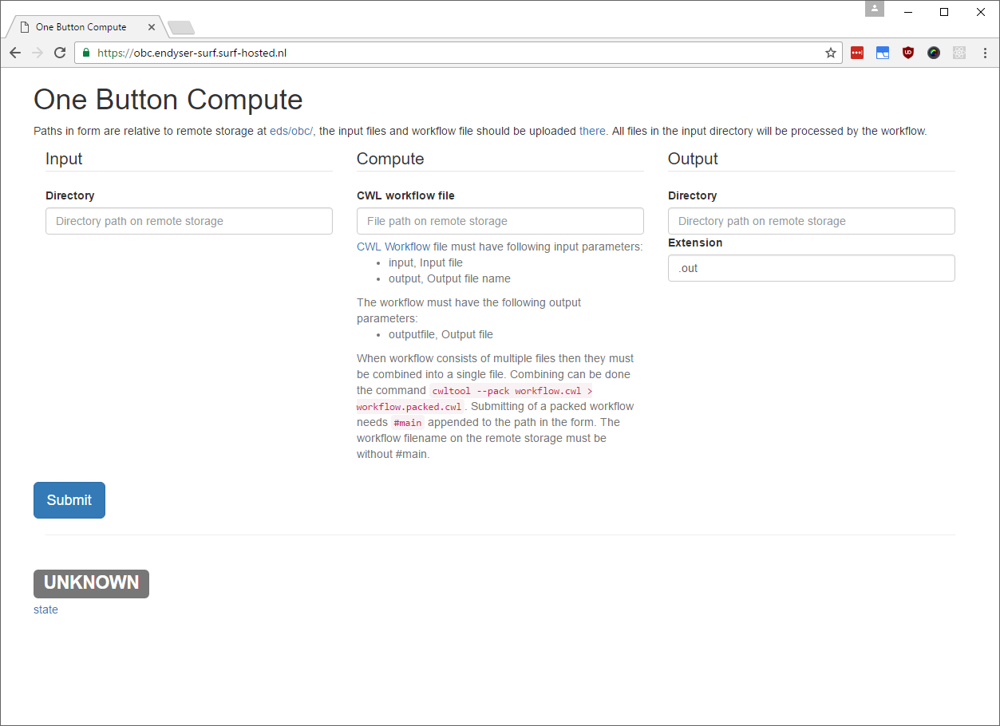
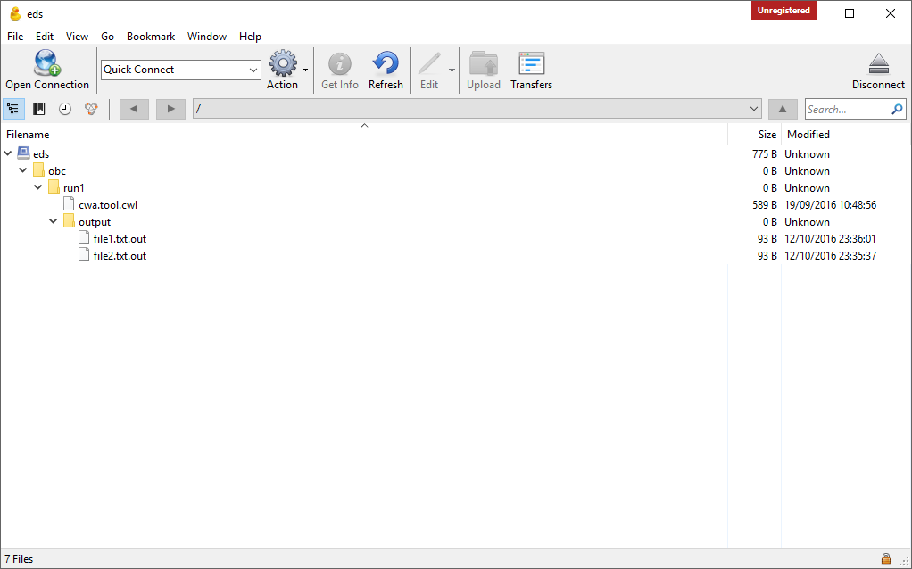
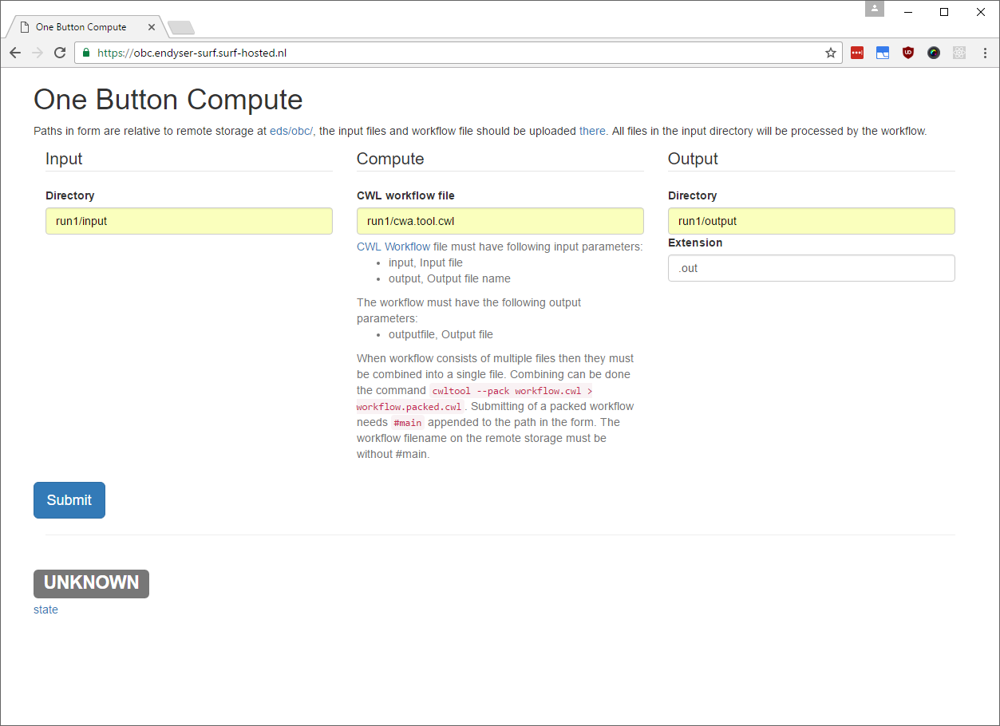
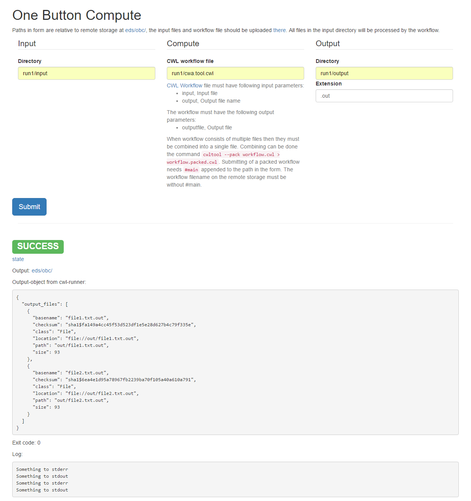
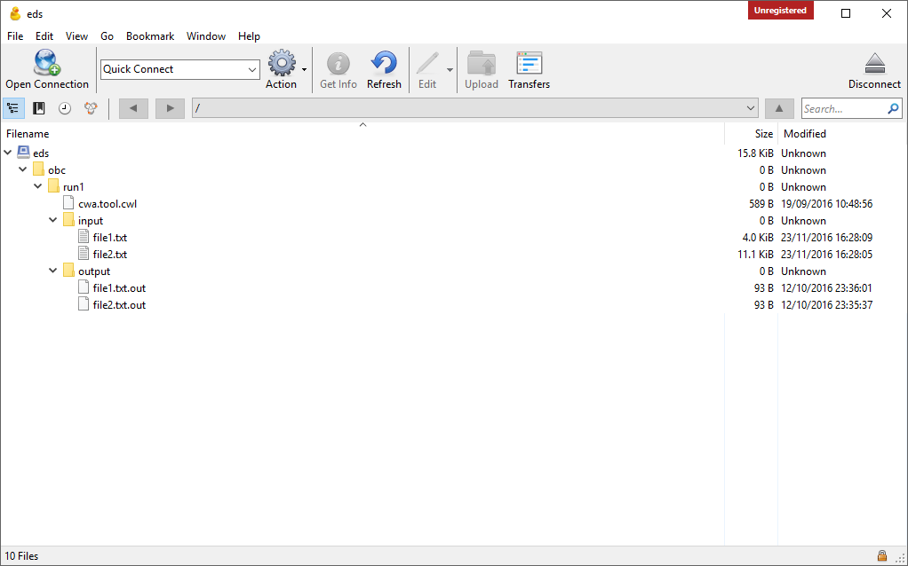

One button compute is a web application that runs a workflow on a list of files.

A screencast of this tutorial available [here](https://www.youtube.com/watch?v=WOjkQ4Y5ouc).

The web application is running at https://obc.endyser-surf.surf-hosted.nl/.
The required credentials to access the application and SWIFT object store are available on request.

The tutorial steps are:
1. [The interface](#the-interface)
2. [The input data](#the-input-data)
3. [The workflow](#the-workflow)
4. [Running it](#running-it)
5. [The output data](#the-output-data)

# 1. The interface



The interface contains:

* Location of input directory
* Location of workflow files
* Location of output directory and extension
* Submit button
* State of computation and log

# 2. The input data

The input files are stored on the SWIFT object store. 
To upload the example input files (and workflow file) to the SWIFT object store will use [CyberDuck](https://cyberduck.io/) desktop application.

The input files are stored in the same subdirectory or SWIFT prefix. 
For this tutorial we will use the files at [input/](input/) directory. 
The One Button Compute application has been configured to have all files relative to the `eds` SWIFT container and `obc` prefix. 
The input files have been uploaded to CyberDuck in `obc/run1/input/` directory.



# 3. The workflow

The workflow will do a wordcount for each file and output the count for each input file.

The workflow [cwa.tool.cwl](https://github.com/surf-eds/one-button-compute/blob/master/example/cwa.tool.cwl) file is written in
in (Common Workflow Language)[http://www.commonwl.org/]. 

The wordcount will execute in a Docker container.
The workflow has a artifical wait of 10 seconds.

# 4. Running it

The input data files and the workflow file are ready for computation.



In the One Button Compute web interface fill form with

* Input directory = run1/input
* CWL workflow file = run1/cwa.tool.cwl
* Output directory = run1/output

Start the computation by pressing the **Submit** button.

The One Button Compute application will perform the following actions:

1. Download the input files and workflow to a local directory
2. Execute the workflow on all the input files
3. Upload the output files to output directory on the SWIFT object store.

The bottom of the page will refesh, until the computation has completed.



# 5. The output data

Lets check CyberDuck to verify there is output.

 

The `obc/run1/output` directory has been created.
The `file1.txt.out` file contains the expected results:
```
      151       560      4094 /var/lib/cwl/stg92366c69-9b40-42c3-be12-1654aedb15c4/file1.txt
```

